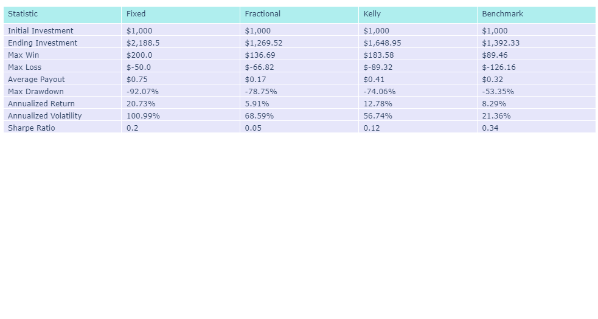
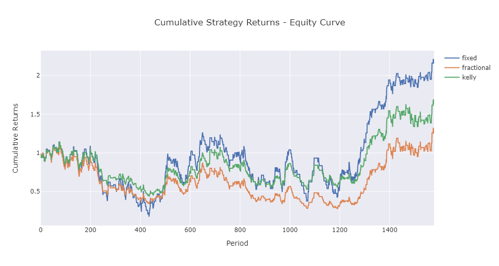
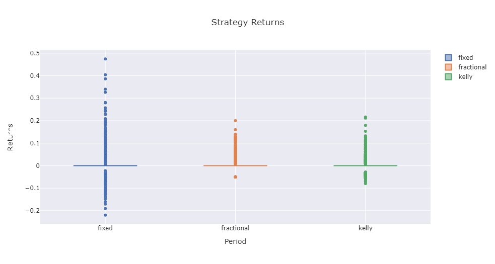

# epl_forecast

**Description**

The repo contains data of English Premier League (EPL) football statistics and betting odds for the last 20 seasons. The goal of this project to augment this data with derived statistics which can be used in machine learning and neural network models and allow one to more accurate predict the outcome of upcoming football matches. 

In addition, one can also use the predicted results to test the profit and loss (pnl) from a betting strategy although this is not the main aim or scope of this project.
__________

  

**Data**

Data for the last 20 seasons (2002/2003 - 2022/2023) were obtained from https://www.football-data.co.uk/englandm.php.
Each file contains data for the respective season as well as other features from the football match such as goals scored, shots taken and betting odds, etc...

  

**Data Cleaning**

The dats for the data were not in a usable format and much manipulation needed to be done in order to get the dates readable, however it was found that after much work the dates were still unreliable and after using generating the required datframes the dates were consequently dropped and replaced by the season. If one wished to get the date of the particular football match, they would just need to look at the season the match took place and then open the corresponsing season data file to find the date of the match and other statistics.

Apart from the data no other major issues were found and as such the data for each season was extracted and pulled into a pandas dataframe for analysis.

  

**Market Probabilities**

 For the betting odds, the price for BET365 was used as it was found that this book making consistently had published prices for each of the 20 seasons in consideration. Using these odd the bookmakers probbailities were extracted. Noting that these probabilities were skewed to incorporate the bookmakers spread or vig, the probabilities were then nomalized to eliminate the bias and true probabilities and odds were calculated.

  

**Elo Probabilities**

To make the analysis more interesting, we then calculated the running elo rating for each team and thereafter for each based on the teams rating a probability of victory was calculated. For those interested in the calculation, you can refer to the jupyter notebook for the formula as well as web articules and youtube videos.

  

**Derived Features**

 Using the goals and shots data for the Home and Away teams as well as the running points total for each team, additional features were calculated. These statistics looked at the running average of the last 6 games. The derived statistics are listed below along with their calculation.

 * AttackPower = avg.TeamGoals / avg.TeamShots
 * DefensePower = avg.OpponentGoals / avg.OpponentShots
 * goalDiffPower = avg.TeamGoals / avg.OpponentGoals -> inf. values were dropped from the dataset.
 * shotDiffPower = avg.TeamShots / avg.OpponentShots
 * formPower = TeamPoints / 18 ~ (18 because max. points for last 6 games is 6x3=18)

 

**Machine Learning Data**

Since the derived features require each team to have played at least 6 games before a statistic can be calculated, a portion of game results were dropped from the final ML dataframe. The statistics for the remaining 32 games for each of teams were retained and merged into a single dataframe to used in machine learning and neural network models. The mlAlgo_full dataframe (and csv file) contains all the statistics including the Home and Away teams and the season the game was played. The mlAlgo dataframe (and file) only contains the quantitative statistics to be used in the predictive models. In both dataframes the Result column respresents the y-variable and the column for which predictions are to be made. This columns contains three numbers with `1` representing a Home Team win, `2` representing an Away Team win and `0` indicating that the match ended in a Draw.

 

**Machine Learning Algorithm**

A lot of work has been done to clean the data and derive additional features. Having constructed an accurate dataframe, the data is now ready to be used in predictive models. Please feel free to use the repo and data for any exploratory work and predictive modelling. 

For my investigation I considered the following Machine Learning Modes:

 * Support Vector Machine (SVM)
 * K-Nearest-Neighbours (KNN) -> with n=3 clusters
 * Decision Tree -> with max_depth=6 (this was done so that the tree could be visualized)
 * Random Forest

 In addition to the above models, the k-means clustering model (along with pca dimensionality reduction) was also calculated, however the results were not very favourable and so were excluded from the analsis. 

 

#### **Machine Learning Results**

| Model              |  Accuracy  |	 homeWin Prec.    |  homeWin Recall |
|--------------------|------------|-------------------|-----------------|
| SVM                |	  0.42	  |      0.51         |        0.64     |
| KNN                |    0.43    |      0.54         |        0.54     |
| Decision Tree      |    0.49    |      0.55         |        0.70     |
| Random Forest  	 |    0.52    |	     0.56         |        0.78     |
| Deep Learning   	 |    0.52    |	     0.55         |        0.79     |

 

From the above we find that the Random forest model performed the best from the machine learning algorithms. In particular the homeWin scores were encouraging. The results for Artificial Neural Network (ANN) Deep Learning Model was satisfactory. The model produced comparable Accuaracy, Precision and Recall scores to the Random Forest Model.

 

#### **Betting Strategy**

Using the Random Forest Model to predict the outcome of football matches (home win, away win or draw) on the test results (last 4 years/seasons), we then applied these predictions to three betsize strategies and compared them to the returns of the benchmark S&P500 index. The three strategies considered were:

 

**Fixed**

This strategy applied a fixed bet amount. For our analysis we used $50 and represented a fixed 5% of our bankroll (bankroll = $1000).

 

**Fractional**

With this strategy we varied our betsize relative to our bankroll. For our analysis we wagered 5% of our bankroll, so as our bankroll increased our betsize increased and conversely for a falling bankroll our betsize decreased.

 

**Kelly**

The Kelly Criterion is a well known betsize strategy in sports betting and finance and sizes bets according to a perceived edge. The formula or calculating the ize of a trade is as follows:

 

#### **K% = (bp - q) / b**

 

Where:

K% = The Kelly percentage that is the fraction of the portfolio to bet. 
b = The decimal odds that is always equal to 1. 
p = The probability of winning. 
q = The probability of losing, which is 1 – p.

 

**Betting Strategy**

Further to the about betsize strategies we also used applied a buffer to our Random Forest predictions. Essentially, we took into account the probability of the prediction from the Random Forest model, if the probability of the outcome predicted by the model was mre than 5% of the probability predicted by the market then we executed the trade. If not, then we passed on placing a bet. 

This allowed us to filter our bets and only wager on those matches where we believed we had an edge over the market. Results of our betsize and betting strategy (using the Random Forest prediction model) can be found below:

 

#### **Betting Strategy Results**

Our results are interesting when compared to returns on the S&P500 index. For the last 4 years/seasons considered the fixed betsize strategy produced the highest annualized return of 20.73% followed by the fractional strategy at 5.91% and Kelly at 12.78%. Both the Kelly and the fixed betsize strategy produced a higher return than the market (8.29%), however all three strategies had a significantly higher annualized volatility and when looking at the srategies Sharpe Ratio's, it appears that on a risk-adjusted bases none of the betsize strategies delivered satisfactory results.

In light of this, these would not be appropriate strategies to use as an alternative to buying the S&P500 index. 

 

### Descriptive Statistics

 

### Cumulative Strategy Returns

 

### BoxPlot of Strategy Returns
